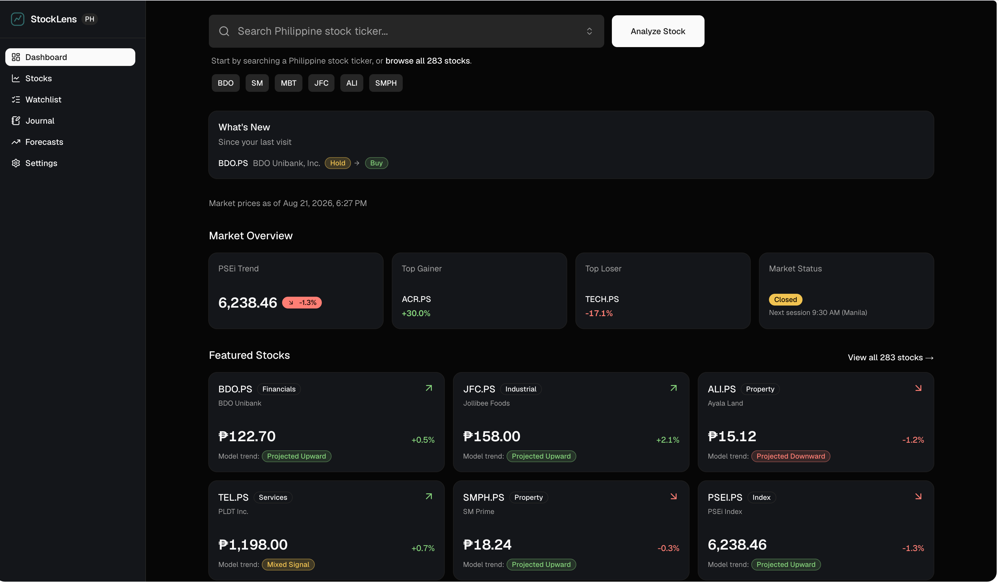
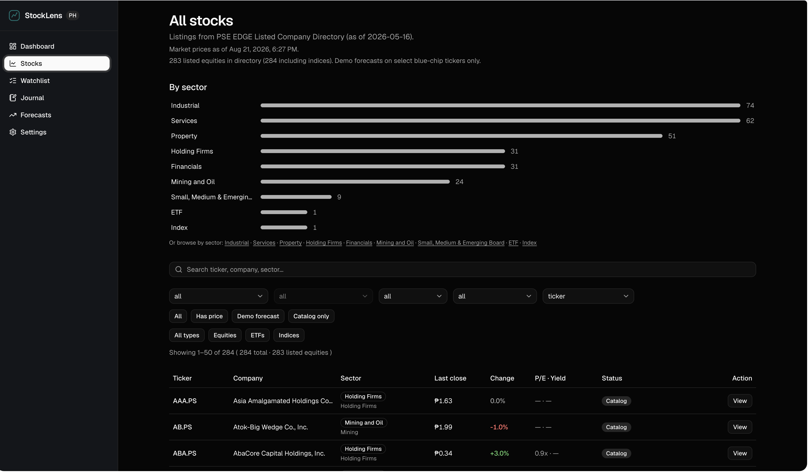

# StockLens PH

Educational Philippine stock analytics dashboard: experimental AI forecasts, a backtested Buy/Hold/Avoid signal with entry/exit plans, real fundamentals scraped from PSE EDGE filings, and a prediction journal. Built with Next.js 16, React 19, Tailwind v4, and shadcn/ui.

Live at [stocklens-ph.vercel.app](https://stocklens-ph.vercel.app) (password-gated — see [Access gate](#access-gate)).

## Screenshots

**Dashboard** — market overview, featured stocks, model trend signals


**All Stocks** — browse all 283 PSE-listed equities by sector, with live prices and P/E · yield


## Disclaimer

**For educational purposes only.** Forecasts are experimental and not financial advice. See `/terms` for full terms.

## Deployment modes (dual EOD)

| Target | `MARKET_DATA_SOURCE` | Prices / PSEi | Analysis & forecasts |
|--------|----------------------|---------------|----------------------|
| **DSS production** | `db` | Supabase `market_quotes_latest` + `market_bars_daily` | Demo seeds in `src/lib/data/` |
| **Vercel preview / CI** | `static` | `data/market-quotes-snapshot.json` | Supabase Storage snapshot (falls back to demo seeds) |

EOD only — not real-time. Batch ingest runs after PSE close; the app never calls EDGE/Yahoo on page load.

**Current production (Vercel) actually runs `db` mode** against the live Supabase project — a deviation from the historical "Vercel = static" split above, made because the signal, fundamentals, and company-stats features need a live DB and have no static-snapshot fallback (unlike quotes/forecasts). A static-mode deploy would show those cards as unavailable, not broken.

## Brand

Logo and accent live in [`src/components/brand/`](src/components/brand/) and [`src/lib/constants/brand.ts`](src/lib/constants/brand.ts) (teal `#0D6E6E`). StockLens PH is not affiliated with the PSE; do not use PSE trademarks in marketing assets.

## Access gate

The whole app sits behind a single shared-password login (`/login`), enforced by [`src/proxy.ts`](src/proxy.ts) — Next.js 16 renamed the `middleware.ts` convention to `proxy.ts`, and it now runs on the Node.js runtime by default (not Edge), which is why the session-token signing can use Node's built-in `crypto` directly with no auth library dependency.

| Var | Purpose |
|-----|---------|
| `APP_PASSWORD` | The shared password checked at `POST /api/auth/login`. |
| `AUTH_SECRET` | Signs the session cookie (HMAC-SHA256). Rotate it to invalidate all existing sessions without changing the password. |

**If either var is unset, the gate fails open** (no login required) — intentional for local dev, but it means a deploy is only actually private once both are set. Sessions last 30 days. Log out from `/settings` (works on both desktop and mobile; the sidebar's logout link is desktop-only, since the mobile bottom nav has no room for it).

## Getting started

```bash
npm install
cp .env.example .env
cp .env.example .env.local   # edit for your target mode
npm run dev
```

Open [http://localhost:3000](http://localhost:3000).

**Local DB mode:** set `MARKET_DATA_SOURCE=db` and `DATABASE_URL` in `.env.local` (full pooler host, e.g. `aws-1-ap-southeast-1.pooler.supabase.com:6543`), run `npm run health:market`, then `ingest:quotes` / `ingest:bars`, then restart dev.

**Local static mode (default):** `MARKET_DATA_SOURCE=static`. Refresh snapshot with `npm run setup:market-data` if prices look outdated.

### Production build

```bash
rm -rf .next && npm run build && npm run start
```

Keep ~2GB free disk space; corrupted `.next` caches can cause 500 errors.

## Routes

| Route | Description |
|-------|-------------|
| `/` | Landing page |
| `/dashboard` | Market overview, search, featured stocks, "What's New" digest |
| `/stocks` | Browse full PSE equity directory (search, sector, subsector) |
| `/watchlist` | Persistent watchlist (localStorage), Portfolio Model Fit + Signal Backtest |
| `/journal` | Prediction journal — log signal calls, auto-resolves against real outcomes |
| `/forecasts` | Forecast summary and model comparison |
| `/settings` | Preferences (localStorage), logout |
| `/terms` | Terms & conditions |
| `/stock/[ticker]` | Stock analysis: signal + entry/exit, company stats, fundamentals, forecasts (e.g. `bdo`, `sm`, `mbt`, `jfc`, `psei`) |
| `/login` | Access-gate sign-in — the only route not behind the gate itself |

**Catalog:** all listed PSE equities in `data/pse-official-universe.json` (synced from PSE EDGE). **Demo analysis & forecasts:** ~30 blue chips + `PSEI.PS` in `src/lib/data/stock-seeds.ts`.

## API (BFF)

| Endpoint | Description |
|----------|-------------|
| `GET /api/market/overview` | Dashboard market data |
| `GET /api/stocks/[ticker]/analysis` | Full stock analysis bundle |
| `GET /api/stocks/[ticker]/history?range=30d` | OHLCV chart points |
| `GET /api/stocks/[ticker]/forecast?horizon=7d&model=lstm` | Forecast for ticker |
| `GET /api/forecasts` | All forecasts list |
| `GET /api/market/quotes?symbols=BDO.PS,SM.PS` | Latest EOD quotes (DB or snapshot) |
| `GET /api/market/signals?symbols=BDO.PS,SM.PS` | Batched consensus signal per ticker |
| `GET /api/watchlist/backtest?tickers=...` | Portfolio-level model-fit backtest |
| `GET /api/watchlist/signal-backtest?tickers=...` | Portfolio-level point-in-time signal backtest |
| `POST /api/auth/login` / `POST /api/auth/logout` | Access-gate session endpoints (see [Access gate](#access-gate)) |

Rate limited (120 req/min per IP). Ticker params validated with Zod.

## Data modes

- **Static (`MARKET_DATA_SOURCE=static`):** Committed snapshot at `data/market-quotes-snapshot.json` plus demo analysis/forecasts. Use on Vercel without Postgres.
- **Database (`MARKET_DATA_SOURCE=db`):** Reads `market_quotes_latest` and `market_bars_daily` via `pg` ([`prisma/schema.prisma`](prisma/schema.prisma)). Use on DSS with cron ingest.

### Supabase + Prisma 7 setup

1. Copy [`.env.example`](.env.example) to **`.env`** (Prisma CLI) and **`.env.local`** (Next.js).
2. **`DATABASE_URL`** — pooler (port **6543**, `?pgbouncer=true`). App on DSS should use a **read-only** role.
3. **`DIRECT_URL`** — direct (port **5432**) for `npm run prisma:migrate` only.
4. Apply schema: `npm run prisma:migrate` && `npm run prisma:generate`
5. **`.env.ingest`** (gitignored) — writer `DATABASE_URL` for cron; see [`db/README.md`](db/README.md).

Runtime uses **`pg`**, not `PrismaClient`. Prisma manages schema; ingest scripts write rows.

For DSS VM database access, use an SSH tunnel before setting `DATABASE_URL`.

### Market data ingest (batch)

Step-by-step ingest and update schedule: [`db/INGEST.md`](db/INGEST.md).

```bash
npm run ingest:quotes      # full listing + PSEi → Postgres
npm run ingest:bars        # OHLCV for all listed equities + PSEI → Postgres
npm run ingest:forecasts   # baseline forecasts + backtest metrics → Postgres
npm run ingest:quotes:snapshot   # also write data/market-quotes-snapshot.json
```

Sources: **PSE EDGE** (default). Fallback: `npm run ingest:quotes -- --source=yahoo`. `ingest:bars` uses Yahoo for **PSEi**; equities fall back to PSE EDGE `DisclosureCht.ax` (Yahoo `.PS` is indices-only). Debug: `npm run ingest:bars -- --probe=BDO --verbose`.

### Ops runbook (DSS)

| Schedule (Manila) | Command |
|-------------------|---------|
| Mon–Fri ~18:00 | `.github/workflows/market-live-refresh.yml` (GitHub Actions, quotes → bars against the live DB) — `db/cron.example.sh` covers the same sequence if run on a VM, but its deployment was never confirmed running |
| Mon–Fri every 10 min, 9:30–15:30 | `market-intraday-refresh.yml` (6 fixed symbols only — powers the dashboard's "Live" indicator; see [`db/INGEST.md`](db/INGEST.md#intraday-dashboard-refresh)) |
| Mon–Fri ~19:30 | `market-forecasts-snapshot.yml` (forecasts, reads the bars refreshed above) |
| Mon–Fri ~20:00 | `signal-notify.yml` (checks `data/notify-watchlist.json` for signal changes, files a GitHub issue if any) |
| Sunday 06:00 | `npm run sync:pse` → commit JSON if listings changed |

**Health checks** (Supabase SQL):

```sql
SELECT COUNT(*) FROM market_quotes_latest;
SELECT COUNT(*) FROM market_bars_daily WHERE symbol = 'PSEI';
SELECT MAX(as_of) FROM market_quotes_latest;
```

Expect ~284 quotes, PSEI bars > 0. Stale UI if `as_of` older than 36 hours.

Full roles, cron, and grants: [`db/README.md`](db/README.md). **DSS VM step-by-step:** [`db/DSS-OPS.md`](db/DSS-OPS.md).

### Vercel / CI static path

1. Vercel env: `MARKET_DATA_SOURCE=static` (no `DATABASE_URL` required).
2. After DSS ingest (or on schedule), refresh the committed snapshot:

```bash
npm run ingest:quotes:snapshot
npm run validate:data
git add data/market-quotes-snapshot.json && git commit -m "chore: refresh market snapshot"
```

3. Optional: enable [`.github/workflows/market-snapshot.yml`](.github/workflows/market-snapshot.yml) in GitHub Actions (weekday schedule or manual `workflow_dispatch`; no `DATABASE_URL`; requires PSE EDGE reachable from GitHub runners).

CI ([`.github/workflows/ci.yml`](.github/workflows/ci.yml)) uses `MARKET_DATA_SOURCE=static` and `npm run validate:data`.

Footer copy: **~283 listed equities** in the directory plus index/ETF rows; **PSEi** is a separate index line. PSEi EOD comes from [PSE EDGE Index Summary](https://edge.pse.com.ph/index/form.do) during ingest.

## Forecast engine

- **Baselines (TypeScript):** `src/lib/forecast/` — naive, MA, linear with walk-forward MAE/RMSE/MAPE
- **Batch ingest:** `npm run ingest:forecasts` writes `market_forecasts_latest` + `market_model_metrics`
- **LSTM (optional):** `npm run ingest:forecasts:lstm` calls `services/forecast/forecast/lstm.py`

MVP checklist: [`docs/MVP.md`](docs/MVP.md).

```bash
cd services/forecast
python3 -m forecast.lstm --closes '[100,101,102,103]' --horizon 7
```

## Signal, backtest & journal

- **Consensus signal** ([`src/lib/signal/`](src/lib/signal/)): Buy/Hold/Avoid per stock, combining the three baseline forecast models weighted by each model's own backtested directional accuracy — LSTM is excluded (it has no backtested accuracy to weight it by, consistent with it already being demoted from "recommended" elsewhere). Entry price, stop-loss, and target are derived separately from ATR and support/resistance, not mixed into the direction call.
- **Backtest**: `npm run backtest:signal` walks the consensus signal back through history at each historical point in time (no lookahead — model weights are recomputed from only the data available as of that day) across the full listed universe. Run it before trusting the signal, or after changing its thresholds. The Signal Backtest card on `/watchlist` runs the same logic scoped to your watchlist.
- **Journal** (`/journal`): log a signal call from any stock page; entries auto-resolve against real closing prices once their horizon passes. Fully localStorage-based, like the watchlist.
- **Dashboard digest**: the "What's New" card on `/dashboard` surfaces watchlist signal changes and newly-resolved journal entries since your last visit — but only when you open the app.
- **Signal-change notifications** (proactive, outside the app): the in-app watchlist lives only in browser localStorage, so a scheduled job has no way to read it. `data/notify-watchlist.json` is a separate, manually-maintained ticker list; `.github/workflows/signal-notify.yml` checks it daily (`npm run check:signal-changes`) against the last-known signal (`data/notify-signal-state.json`, committed back each run) and files a GitHub issue when one changes. Keep the two ticker lists in sync yourself — there's no automatic link between them.

## Fundamentals & company stats

Two tiers, both scraped from PSE EDGE HTML — no PDF parsing (see the scripts' file headers for the exact endpoints used):

- **Company stats** (`company_stats_latest`): market cap, outstanding shares, free float %, foreign ownership limit, par value — pulled from the same `stockdataList` endpoint already used for live quotes. `npm run ingest:company-stats`.
- **Fundamentals** (`fundamentals_latest`): P/E, P/B, EPS (trailing 12mo), revenue and net income (year-to-date), book value/share, dividend yield (trailing 12mo) — parsed from the structured HTML cover sheet PSE EDGE renders for each company's latest SEC Form 17-Q filing. `npm run ingest:fundamentals`.

Both are manual/occasional ingests, not scheduled crons — this data moves slowly (quarterly filings, rarely-changing share counts). P/E, P/B, and dividend yield are computed at render time against the current price rather than stored, so they're never stale between ingest runs.

## Scripts

| Command | Description |
|---------|-------------|
| `npm run dev` | Development server |
| `npm run build` | Production build |
| `npm run lint` | ESLint |
| `npm run test` | Vitest unit tests |
| `npm run sync:pse` | Refresh `data/pse-official-universe.json` from PSE EDGE |
| `npm run ingest:quotes` | Batch EOD quotes → Postgres (+ optional snapshot) |
| `npm run ingest:bars` | Daily OHLCV for all listed equities → Postgres (exits 1 if PSEI missing) |
| `npm run ingest:forecasts` | Baseline forecasts + metrics → Postgres |
| `npm run ingest:forecasts:snapshot` | Forecasts ingest + publish to Supabase Storage (`SUPABASE_URL`/`SUPABASE_SERVICE_ROLE_KEY` required) |
| `npm run ingest:forecasts:lstm` | Optional LSTM forecasts via Python |
| `npm run ingest:company-stats` | Market cap, free float, etc. → Postgres (manual/occasional) |
| `npm run ingest:fundamentals` | P/E-relevant fundamentals → Postgres (manual/occasional) |
| `npm run backtest:signal` | Full-universe point-in-time consensus-signal backtest report |
| `npm run ingest:quotes:snapshot` | Quotes ingest + write snapshot file |
| `npm run setup:market-data` | Same as snapshot ingest (static/Vercel refresh) |
| `npm run validate:data` | Validate universe JSON (+ snapshot) for CI |
| `npm run health:market` | Verify Postgres quotes/bars after ingest (DSS cron) |
| `npm run setup:dss` | Validate `DATABASE_URL` + health; add `-- --ingest` for full EOD run |
| `npm run prisma:migrate` | Apply Prisma migrations (`DIRECT_URL`) |
| `npm run prisma:generate` | Generate client to `src/generated/prisma` |
| `npm run prisma:studio` | Browse data in Prisma Studio |

### PSE directory sync

```bash
npm run sync:pse
```

Requires network access to `edge.pse.com.ph`. Commit updated `data/pse-official-universe.json` when listings change.

## Deploy

- **Vercel:** `MARKET_DATA_SOURCE=static` + committed snapshot for quotes/forecasts only, no DB secrets — or `MARKET_DATA_SOURCE=db` + `DATABASE_URL` for the full feature set (signal, fundamentals, and company stats all need a live DB; they have no static fallback). Current production runs `db` mode.
- **DSS:** `MARKET_DATA_SOURCE=db`, readonly `DATABASE_URL`, cron with writer creds in `.env.ingest`.

**Either target:** set `APP_PASSWORD` + `AUTH_SECRET` before the deployment is reachable by anyone but you — see [Access gate](#access-gate). The gate fails open without them.

Rotate Supabase passwords if credentials were ever exposed. Never commit `.env`, `.env.local`, or `.env.ingest`.

## Error monitoring

Sentry (`@sentry/nextjs`) is wired in but inert until a DSN is configured — see [`docs/OBSERVABILITY.md`](docs/OBSERVABILITY.md).
